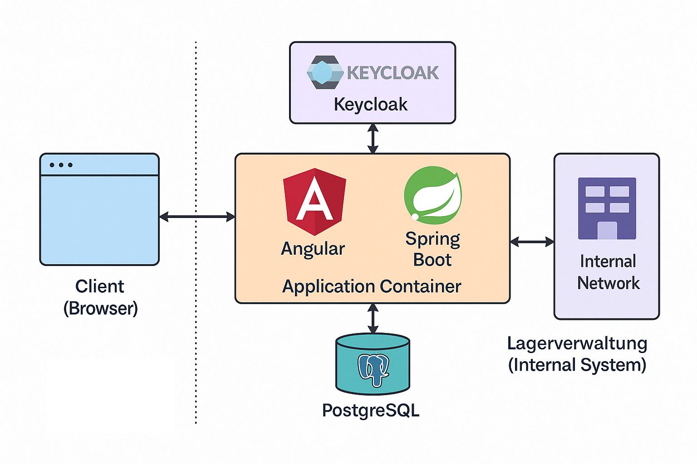

# Kapitel 3 – Zielarchitektur

## Architekturüberblick

Die Architektur der Anwendung besteht aus vier Kernkomponenten:

- **Angular Frontend** (SPA)
- **Spring Boot Backend (BFF)**
- **Keycloak** für Authentifizierung via OAuth2
- **PostgreSQL** als zentrale Datenbank

Die gesamte Anwendung läuft containerisiert. Das Frontend wird als statischer Content zusammen mit dem Backend ausgeliefert.

## Authentifizierungskonzept

Die Anwendung implementiert einen **sicheren OAuth2 Authorization Code Flow mit Keycloak**, basierend auf folgendem Prinzip:

- Tokens werden **ausschließlich im Backend** gespeichert
- Das Frontend erhält ein sicheres `auth_sid`-Cookie (HttpOnly, Secure)
- Bei jedem Request überprüft das Backend die Gültigkeit der Session
- Tokenhandling und Erneuerung erfolgt serverseitig

👉 Details dazu finden sich im separaten Dokument: **[auth-flow.md](assets/auth-flow.md)**

## Visualisierung der Architektur

Eine vereinfachte Darstellung der Systemarchitektur:

## Abgrenzung MVP vs. finale Lösung

- Das MVP enthält: Login, Materialliste (Mock), Versandjob-Erstellung, mandantensichere Datenlogik
- Späterer Ausbau: Synchronisation mit lokaler Lagerverwaltung und Warenwirtschaftssystem
